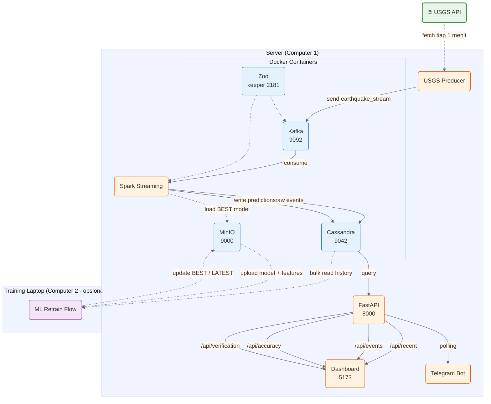

# Setup & Inisialisasi

## Arsitektur & Data Flow



> **Legend:** ➡️ data flow (streaming / request) · ╌╌╌ periodic / batch

Alur lengkap:
1. **USGS Producer** fetch gempa dari USGS API → kirim ke **Kafka**
2. **Spark Streaming** consume dari Kafka → feature eng + prediksi → simpan ke **Cassandra**
3. **Spark Streaming** load model dari **MinIO** (tag `BEST`), reload otomatis tiap 5 menit
4. **FastAPI** baca dari Cassandra → serve ke **Dashboard** & **Telegram Bot**
5. **Retrain Flow** (opsional, bisa dari laptop terpisah) baca semua history dari Cassandra → train → upload ke MinIO → champion/challenger

---

## Prerequisites

- Docker & Docker Compose
- Python 3.14+, `uv`
- Node.js 18+, npm
- Java 17 (untuk Spark)
- Minimal 8GB RAM, 20GB free disk

## 1. Clone & Environment

```bash
git clone <repo-url>
cd Projek_ROSBD_Kelompok3

# Buat virtual env & install dependencies
uv venv
source .venv/bin/activate
uv sync

# Install dashboard dependencies
cd dashboard && npm install && cd ..
```

## 2. Start Infrastructure (Docker)

```bash
docker compose -f docker/docker-compose.yml up -d
```

Menjalankan: **Zookeeper** (2181), **Kafka** (9092), **Cassandra** (9042), **MinIO** (9000/9001).

Cek status:

```bash
docker ps
# Semua container harus "healthy" atau "Up"
```

## 3. Seed & Backfill (Bulk CSV + Backfill USGS + Initial Predictions)

Memasukkan data historis CSV, mengambil gap data dari USGS, komputasi feature,
dan membuat prediksi awal untuk semua grid.

```bash
uv run ml-model/seed_and_backfill.py
```

Proses ini akan:
1. **Create schema** (keyspace + tabel di Cassandra)
2. **Bulk insert CSV** (`dataset_gempa_bigdata.csv`) → `earthquake_history`
3. **Backfill gap** dari timestamp terakhir CSV sampai sekarang dari USGS API
4. **Compute features** → simpan `ml-model/latest_features.json`
5. **Predict** semua grid dengan model lokal → upsert `latest_events`

Tunggu hingga log muncul: `"Seed & Backfill Complete"`.

## 4. MinIO Init (Bucket & Model Seed)

Pastikan MinIO sudah ready (`docker ps | grep minio`).
Buat bucket dan upload model + features pertama ke MinIO:

```bash
uv run python3 -c "
import sys; sys.path.insert(0, 'ml-model')
from minio_utils import get_client, ensure_bucket, version_tag, \
    upload_model, upload_features, upload_metrics, write_tag

client = get_client()
ensure_bucket(client)
v = version_tag()
upload_model(client, 'ml-model/spark_rf_model', v)
upload_features(client, 'ml-model/latest_features.json', v)
metrics = {'mae': 0, 'rmse': 0, 'r2': 0, 'timestamp': v}
upload_metrics(client, metrics, v)
write_tag(client, 'BEST', v)
write_tag(client, 'LATEST', v)
print(f'Bucket ready, BEST = {v}')
"
```

Akses console: **http://localhost:9001** (user: `minioadmin`, pass: `minioadmin`).

## 5. Start Spark Streaming (Real-time)

Mulai consume event baru dari Kafka dan prediksi real-time.
Streaming otomatis load model dari MinIO (tag `BEST`) atau fallback ke lokal.

```bash
uv run spark-consumer/stream_processor.py &
```

Tunggu hingga log muncul: `"Started Spark Streaming"`.
Setiap 5 menit streaming akan polling MinIO untuk cek model BEST baru.

> **Catatan**: Jika restart, hapus checkpoint yang corrupt:
> ```bash
> pkill -f stream_processor
> rm -rf checkpoint_dir_cassandra checkpoint_dir_history
> uv run spark-consumer/stream_processor.py &
> ```

## 6. Start USGS Producer

Mengirim data gempa real-time dari USGS ke Kafka.

```bash
uv run producer/usgs_producer.py &
```

Cek log: `"Successfully sent N new earthquakes."`

## 7. Start FastAPI API

```bash
uv run api/main.py &
```

Server API berjalan di **http://localhost:8000**.

Cek:

```bash
curl http://localhost:8000/api/recent?limit=5
curl http://localhost:8000/api/accuracy
```

## 8. Start Dashboard

```bash
cd dashboard && npm run dev &
```

Vite dev server di **http://localhost:5173**.

## 9. Start Telegram Bot

```bash
uv run telegram-bot/bot.py &
```

Bot mengirim alert prediksi active + verifiable ke grup Telegram.

## 10. Retrain Model (Manual / Otomatis)

Retrain membaca semua `earthquake_history` dari Cassandra, melatih ulang model,
lalu upload ke MinIO dengan champion/challenger (compare MAE dengan BEST).

### Manual

```bash
uv run ml-model/train.py
```

### Otomatis (Prefect)

```bash
uv run ml-model/retrain_flow.py &
```

Prefect akan menjalankan ulang tiap jam 03:00. Hasil training akan:

1. Save model ke `ml-model/spark_rf_model/` + `latest_features.json`
2. Upload model + features + metrics ke MinIO (`v_{timestamp}/`)
3. Bandingkan MAE dengan model `BEST` saat ini
4. Update `BEST` kalau lebih bagus (champion/challenger)

## 11. Verifikasi

| Cek | Command / Cara |
|---|---|
| Data gempa masuk | `curl http://localhost:8000/api/recent?limit=5` |
| Prediksi ada | `curl http://localhost:8000/api/accuracy` |
| Dashboard muncul | Buka `http://localhost:5173` di browser |
| Streaming berjalan | `tail -f spark-consumer/*.log` |
| MinIO berisi model | Buka `http://localhost:9001` → bucket `ml-models` |
| Model auto-reload | `tail -f spark-consumer/*.log` — muncul `"New BEST model detected"` |

## Troubleshooting

| Masalah | Solusi |
|---|---|
| Spark crash / checkpoint error | `pkill -f stream_processor; rm -rf checkpoint_dir_*` lalu restart step 5 |
| Cassandra timeout | `docker logs cassandra` — pastikan healthy (`docker ps`) |
| Kafka tidak connect | `docker logs kafka` — cek error |
| Kafka offset conflict | `pkill -f stream_processor; rm -rf checkpoint_dir_*` lalu restart |
| API error saat startup | Pastikan Cassandra sudah up, seed & backfill step 3 sudah selesai |
| Port sudah dipakai | Ubah di `.env` atau `docker/docker-compose.yml` |
| Data tidak muncul di dashboard | Cek API langsung (`curl ...`). Jika API OK, refresh dashboard (F5) |
| Producer "No new earthquakes" | Normal — USGS rilis data tiap 1-5 menit |
| seed_and_backfill gagal | Pastikan CSV (`dataset_gempa_bigdata.csv`) ada di root, koneksi Cassandra lancar |
| MinIO tidak reachable | `docker logs minio` — cek error. Pastikan healthy |
| Streaming stuck di model lama | Cek MinIO console: bucket `ml-models` ada tag `BEST`? |
| Bot mati | `pkill -f bot.py; uv run telegram-bot/bot.py &` |
| Ingin re-init ulang | `pkill -f stream_processor; python3 -c "from cassandra.cluster import Cluster; c=Cluster(); s=c.connect(); s.execute('DROP KEYSPACE earthquake_db')"` lalu ulangi dari step 3 |

## Port Summary

| Port | Service |
|---|---|
| 2181 | Zookeeper |
| 9092 | Kafka |
| 9042 | Cassandra |
| 9000 | MinIO S3 API |
| 9001 | MinIO Console |
| 8000 | FastAPI |
| 5173 | Dashboard (Vite) |
