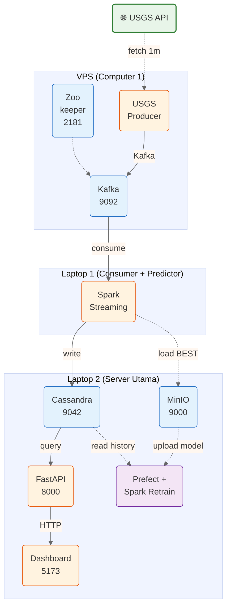

# Setup & Inisialisasi

## Arsitektur & Data Flow



> **Legend:** ➡️ data streaming · ╌╌╌ periodic/batch · warna: 🟢 external · 🔵 infra · 🟠 app · 🟣 training

Alur:
1. **VPS** → USGS Producer fetch gempa → Kafka (retention 7 hari)
2. **Laptop 1** → Spark Streaming consume Kafka → predict → write ke Cassandra L2
3. **Laptop 2** → Cassandra simpan semua data → FastAPI serve → Dashboard tampil
4. **Laptop 2** → Prefect retrain periodik baca Cassandra → train → upload ke MinIO
5. **Laptop 1** → Polling MinIO L2 tiap 5 menit, reload model BEST

---

## Prerequisites (Semua Komputer)

- Python 3.14+, `uv`
- Java 17 (khusus yang jalan Spark: Laptop 1 & L2)
- Node.js 18+, npm (khusus Laptop 2 untuk Dashboard)
- Docker & Docker Compose (khusus VPS & Laptop 2)

---

## Setup VPS (Kafka Broker + Producer)

### 1. Clone & Environment

```bash
git clone <repo-url>
cd Projek_ROSBD_Kelompok3
uv venv
source .venv/bin/activate
uv sync
```

### 2. Start Docker (Zookeeper + Kafka)

```bash
docker compose -f docker/docker-compose-vps.yml up -d
```

Cek:

```bash
docker ps
# zookeeper & kafka harus healthy
```

### 3. Verifikasi Kafka Advertised Listeners

Pastikan IP di `docker/docker-compose-vps.yml` sudah sesuai IP publik VPS:

```yaml
KAFKA_ADVERTISED_LISTENERS: PLAINTEXT://kafka:29092,PLAINTEXT_HOST://168.144.97.105:9092
```

Jika sudah, restart:

```bash
docker compose -f docker/docker-compose-vps.yml down
docker compose -f docker/docker-compose-vps.yml up -d
```

### 4. Start USGS Producer

```bash
uv run producer/usgs_producer.py &
```

Cek log: `"Successfully sent N new earthquakes."`

### 5. Config `.env` VPS

```env
KAFKA_BROKER=localhost:9092
# CASSANDRA_HOST & MINIO tidak perlu (tidak ada di VPS)
```

---

## Setup Laptop 2 (Cassandra + MinIO + FastAPI + Dashboard + Retrain)

### 1. Clone & Environment

```bash
git clone <repo-url>
cd Projek_ROSBD_Kelompok3
uv venv
source .venv/bin/activate
uv sync
cd dashboard && npm install && cd ..
```

### 2. Start Docker (Cassandra + MinIO)

```bash
docker compose -f docker/docker-compose-l2.yml up -d
```

Cek:

```bash
docker ps
# cassandra & minio harus healthy
```

### 3. Config `.env` Laptop 2

```env
KAFKA_BROKER=168.144.97.105:9092
CASSANDRA_HOST=localhost
MINIO_ENDPOINT=localhost:9000
```

> **Catatan:** `KAFKA_BROKER` untuk akses ke VPS. `CASSANDRA_HOST` & `MINIO_ENDPOINT` lokal karena Cassandra & MinIO jalan di Laptop 2 sendiri. Pastikan Laptop 2 bisa reach VPS via `ping 168.144.97.105`.

### 4. Seed & Backfill (Bulk CSV + Inisialisasi Cassandra)

```bash
uv run ml-model/seed_and_backfill.py
```

Proses:
1. Create keyspace & tabel di Cassandra
2. Bulk insert CSV → `earthquake_history`
3. Backfill gap dari USGS
4. Compute features → `latest_features.json`
5. Predict semua grid dengan model lokal → `latest_events`

Tunggu: `"Seed & Backfill Complete"`

### 5. MinIO Init

Upload model + features pertama ke MinIO:

```bash
uv run python3 -c "
import sys; sys.path.insert(0, 'ml-model')
from minio_utils import get_client, ensure_bucket, version_tag, \
    upload_model, upload_features, upload_metrics, write_tag

client = get_client()
ensure_bucket(client)
v = version_tag()
upload_model(client, 'ml-model/spark_rf_model', v)
upload_features(client, 'ml-model/latest_features.json', v)
metrics = {'mae': 0, 'rmse': 0, 'r2': 0, 'timestamp': v}
upload_metrics(client, metrics, v)
write_tag(client, 'BEST', v)
write_tag(client, 'LATEST', v)
print(f'Bucket ready, BEST = {v}')
"
```

Akses console: **http://localhost:9001** (user: `minioadmin`, pass: `minioadmin`)

### 6. Start FastAPI

```bash
uv run api/main.py &
```

Cek:

```bash
curl http://localhost:8000/api/recent?limit=5
curl http://localhost:8000/api/accuracy
```

### 7. Start Dashboard

```bash
cd dashboard && npm run dev &
```

Buka **http://localhost:5173**.

### 8. Start Retrain (Prefect)

```bash
uv run ml-model/retrain_flow.py &
```

Prefect menjadwalkan retrain tiap jam 03:00. Otomatis:
1. Baca semua `earthquake_history` dari Cassandra
2. Feature engineering
3. Train Random Forest
4. Upload model + features + metrics ke MinIO (`v_{timestamp}/`)
5. Bandingkan MAE dengan model `BEST`
6. Update `BEST` kalau lebih bagus

### 9. Start Telegram Bot (Opsional)

```bash
uv run telegram-bot/bot.py &
```

---

## Setup Laptop 1 (Spark Streaming - Consumer + Predictor)

### 1. Clone & Environment

```bash
git clone <repo-url>
cd Projek_ROSBD_Kelompok3
uv venv
source .venv/bin/activate
uv sync
```

### 2. Config `.env` Laptop 1

```env
KAFKA_BROKER=168.144.97.105:9092
CASSANDRA_HOST=100.68.78.82
MINIO_ENDPOINT=100.68.78.82:9000
```

> `CASSANDRA_HOST` & `MINIO_ENDPOINT` pakai IP Tailscale Laptop 2 agar koneksi aman. Pastikan Laptop 1 sudah join Tailscale dan bisa `ping 100.68.78.82`.

### 3. Start Spark Streaming

```bash
uv run spark-consumer/stream_processor.py &
```

Tunggu: `"Started Spark Streaming"`.

Streaming akan:
1. Consume Kafka dari VPS (`KAFKA_BROKER`)
2. Feature engineering + ML predict
3. Write hasil ke Cassandra Laptop 2 (`CASSANDRA_HOST`)
4. Polling MinIO Laptop 2 tiap 5 menit untuk cek model BEST baru
5. Kalau model baru terdeteksi → reload otomatis (stop queries → download model → restart)

> **Catatan restart:**
> ```bash
> pkill -f stream_processor
> rm -rf checkpoint_dir_cassandra checkpoint_dir_history
> uv run spark-consumer/stream_processor.py &
> ```

---

## Verifikasi (dari Laptop 2)

| Cek | Command / Cara |
|---|---|
| Data gempa masuk | `curl http://localhost:8000/api/recent?limit=5` |
| Prediksi ada | `curl http://localhost:8000/api/accuracy` |
| Dashboard muncul | Buka `http://localhost:5173` |
| Streaming berjalan di L1 | `tail -f spark-consumer/*.log` (di Laptop 1) |
| MinIO berisi model | Buka `http://localhost:9001` → bucket `ml-models` |
| Model auto-reload | Di log L1: `"New BEST model detected"` |
| Kafka data aman | `docker exec kafka kafka-console-consumer --bootstrap-server localhost:9092 --topic earthquake_stream --from-beginning --max-messages 5` (di VPS) |

---

## Troubleshooting

| Masalah | Solusi |
|---|---|
| L1 gabung connect ke Kafka VPS | Pastikan `KAFKA_ADVERTISED_LISTENERS` di VPS pakai IP publik, firewall port 9092 terbuka |
| L1 gabung connect ke Cassandra L2 | Pastikan `CASSANDRA_HOST=<IP_L2>`, firewall port 9042 terbuka |
| L1 gabung connect ke MinIO L2 | Pastikan `MINIO_ENDPOINT=<IP_L2>:9000`, firewall port 9000 terbuka |
| Spark crash / checkpoint error | `pkill -f stream_processor; rm -rf checkpoint_dir_*` lalu restart di L1 |
| Cassandra timeout | `docker logs cassandra` di L2 — pastikan healthy |
| Kafka offset conflict | `pkill -f stream_processor; rm -rf checkpoint_dir_*` lalu restart di L1 |
| Data tidak muncul di dashboard | Cek API langsung (`curl ...`). Jika OK, refresh dashboard (F5) |
| Producer "No new earthquakes" | Normal — USGS rilis data tiap 1-5 menit |
| seed_and_backfill gagal | Pastikan CSV (`dataset_gempa_bigdata.csv`) ada di root, koneksi Cassandra lancar |
| Streaming stuck di model lama | Cek MinIO console L2: bucket `ml-models` ada tag `BEST`? |
| Kafka data hilang | Default retention 7 hari. Data aman selama L1 connect dalam 7 hari |

---

## Port Summary

| Port | Service | Lokasi |
|---|---|---|
| 2181 | Zookeeper | VPS |
| 9092 | Kafka | VPS |
| 9042 | Cassandra | Laptop 2 |
| 9000 | MinIO S3 API | Laptop 2 |
| 9001 | MinIO Console | Laptop 2 |
| 8000 | FastAPI | Laptop 2 |
| 5173 | Dashboard (Vite) | Laptop 2 |
